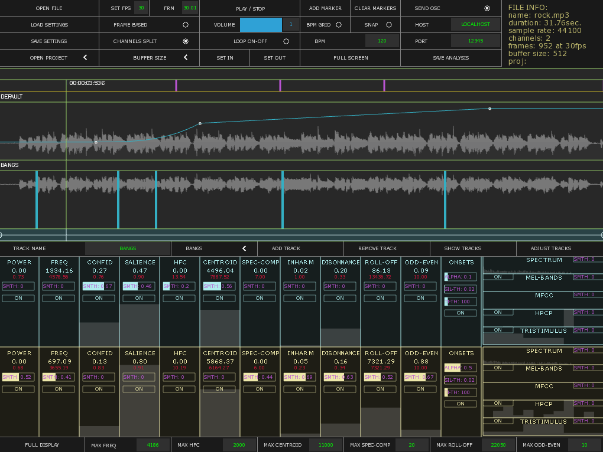

# Sonoscopio
#### Free and open source audio analysis tool.

*(!) Software still in development. This is currently a beta testing version, use it your own risk*

Demo video: https://vimeo.com/191193752

## Main features

- Wav & mp3 files loading
- Mono and multi-channel analysis
- Timeline integrated with zoom, markers, bpm grid, and custom tracks (curves, bangs, switches). [+ info](https://github.com/YCAMInterlab/ofxTimeline#track-types)
- Configurable Smoothing parameters
- OSC data sending
- Save/Load settings and projects
- Real Time & Offline analysis modes

## Analysis algorithms

RMSPitch frequency, Pitch Confidence, Pitch Salience, HFC, Centroid, Inharmonicity, Spectral Complexity, Dissonance, Roll Off, Odd To Even Harmonic Energy Ratio, Onsets, Spectrum, Mel Bands, MFCC, Harmonic Pitch Class Profile, Tristimulus.
More info [here](https://github.com/leozimmerman/ofxAudioAnalyzer)

## Compatibility
Only working in OSX for the moment. Going to add Linux compatibility soon.

## Installation

- Download OF 0.9.3
- Clone this repository into OF_ROOT_DIR/apps/myApps/
- Run clone_addons.sh in the terminal
- Build Xcode project

  Tested with:
  - OF 0.9.3
  - OS X El Capitan: version 10.11.6
  - X code 8
  - OSX SDK 10.11 (!)

## Projects & Settings

* If none project is opened, it will save and load settings to/from:

  - bin/data/main_settings/
  - bin/data/meters_settings/
  - bin/data/timeline_settings/

* "Open Project" dropdown button list projects in:

  - bin/data/projects

* If a Project is open, "Load Settings" and "Save Settings" will load/save to the project's settings files.

* A project folder must have:

 - audiofile.wav or audiofile.mp3
 - main_settings/
 - meters_settings/
 - timeline_settings/

* Creating a New Project (manually at the moment):

 - Open app with no project loaded
 - Open audio file, set settings and save them.
 - Create a folder in bin/data/projects with the projects name.
 - Copy the file used and rename it "audiofile".
 - Copy the settings files from bin/data to bin/data/projects/PROJECT_NAME/  

## Keys Commands

* 't' : time measurement on/off
* 'm' : add marker
* 'w' : rewind
* 'e' : expands focused track
* 'd' : enables/disables focused track
* 'a' : adjust tracks height shortcut

## OSC
For receiving OSC data in another app:

- Per audio channel (ch0, ch1, ch2, etc):
     + address "/ch0" : all Single Values in sames order as Osc Indexes (ofxAudioAnalyzerAlgorithms.h)
     + address "/ch0mel": Mel Bands - size=24
     + address "/ch0mfcc": MFCC - size=13
     + address "/ch0hpcp": HPCP - size=12
     + address "/ch0tris": Tristimulus - size=3

 - Per Timeline Track:
     + address "/TL-(trackname)": El value del track

## Dependencies
*Sonoscopio* uses several open source repositories, projects, libraries, etc. Run *clone_addons.sh* to clone all of them easily.

- [openFrameworks](http://openframeworks.cc/): Main app's core functionality.
- [ofxAudioAnalyzer](https://github.com/leozimmerman/ofxAudioAnalyzer): For the audio analysis engine. This addon uses [Essentia](http://essentia.upf.edu/) library.
- [ofxTimeline](https://github.com/YCAMInterlab/ofxTimeline): For the integrated timeline functionality.
- [ofxDatGui](https://github.com/braitsch/ofxDatGui): For the graphical user interface.
- ofxAudioDecoder
- ofxMSATimer
- ofxRange
- ofxTextInputField
- ofxTimeMeasurements
- ofxTimecode
- ofxTween

## License
This software is distributed under  Affero GPLv3 license. See [License](LICENSE)
